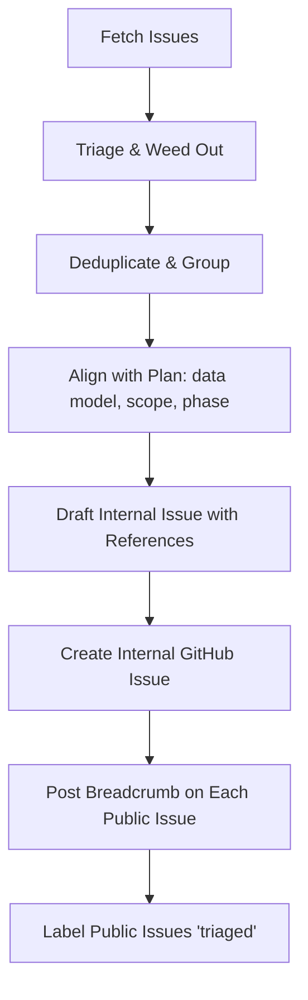

# Feedback Rationalizer Skill (triage)

Adapted from `evanda/bub`. Same shape — fetch public feedback, weed out,
dedupe/group, align to the architecture, draft unified internal issues, and keep
a two-way breadcrumb so reporters get closed out when work ships — retargeted to
this **CMMS** (campus facilities maintenance) project and **tied to the phase
plan** in `facility-maintenance-app-plan.md` §11.

Repos (overridable via env in `fetch_issues.js`):
- **Public feedback intake:** `evanda/cmc-feedback` (`CMC_FEEDBACK_REPO`)
- **Internal work tracking:** `evanda/cmc` (`CMC_INTERNAL_REPO`)

---

## Workflow Overview



---

## Step 1: Fetching Issues

Run the workspace-level Node.js script to pull issues from both repos:

```bash
node .agents/skills/feedback-rationalizer/scripts/fetch_issues.js [output_file.json]
```

Outputs to `feedback_issues.json` by default. Read that file to review active issues.

---

## Step 2: Triage & Weeding Out

Evaluate each public issue against the project's standing constraints. Weed out
(or close with an explanation) ideas that violate them:

1. **In scope = the CMMS modules.** Requests should enhance an actual module
   (plan §4): Asset Registry, Work Requests/Orders, Preventive Maintenance,
   Vendors/Contacts/Service Contracts, Fleet, Spatial map + POIs, Inspections,
   Cost/Reporting. Anything outside this — close it.
2. **Hard out-of-scope for v1 (plan §13).** Reject or label `future`:
   room booking / event scheduling, full accounting / GL / invoicing / payroll,
   IoT / predictive-maintenance / sensor ingestion, and parts/inventory (v2
   unless they actually stock parts). Cost tracking stops at WO estimate-vs-actual
   and the capital forecast.
3. **Single-tenant, church-agnostic (plan §7.6).** Reject anything that pushes
   toward multi-tenant SaaS, or that would hardcode one church's name/branding/
   campus into code. Church-specific values are **config or content** (the
   single-row `org_settings`/`facilities`, seed data, the loader) — never
   constants in source. The *only* trigger for multi-tenant work is the operator
   deciding to centrally host many churches; that's a business decision, not a
   feature request.

---

## Step 3: Phase-Gate Against the Build Order (plan §11)

This is the CMMS-specific addition to bub's flow. Tag each surviving request with
the phase that owns it, and **defer requests that belong to a later phase than
the one currently in flight** (current phase is noted in `CLAUDE.md` → "Current
task"). Don't pull Phase 3 work forward into Phase 0.

| Phase | Owns | Typical requests |
|-------|------|------------------|
| **0 — Foundation** | monorepo, Supabase schema (§6), auth/RLS, `org_settings`/`facilities`, buildings/floors/locations, seed fixtures | setup wizard, roles, building/floor/location CRUD |
| **1 — MVP** | Asset Registry (+ QR tags), Work Requests→Orders, Vendors/Contacts, List + Calendar, dashboard | asset fields, WO lifecycle, cost capture, vendor directory |
| **2 — Spatial** | loader tool, single MapLibre map (satellite + footprints + georeferenced floor overlays + POIs), level switcher, facility export/import | map UX, floor switching, POI types, georeferencing |
| **3 — Proactive** | PM engine (calendar + meter), auto-WO generation, inspections/checklists, fleet (vehicles/meters/renewals), compliance dashboard, expiry sweeps | PM schedules, meter triggers, pre-trip checklists, COI/warranty alerts |
| **4 — Insight & mobile** | reporting (cost, PM compliance, capital forecast), Expo mobile app, in-app QR scan, push, offline | reports, mobile field actions, offline-first |

A later-phase request is still worth capturing — file it with the matching
`phase:*` label and a `future` label so it surfaces when that phase opens, rather
than dropping it.

---

## Step 4: Check for Existing Internal Coverage

Before grouping or drafting, cross-check the public issues against
`internalIssues` from the fetched JSON. If an open internal issue already covers
the same problem, note it (comment-link the public issue there if helpful) rather
than creating a duplicate. Watch especially for an architecture/foundation issue
that already addresses a user-visible symptom without being labelled as such.

---

## Step 5: Confirm Judgment Calls with User

**Before creating any issues on GitHub**, present a triage summary:

1. **Clear bugs** — state these as "will create" (bugs are almost always worth fixing).
2. **Deferred items** — briefly explain why (out of scope §13, or a later phase).
3. **Features requiring judgment** — use `AskUserQuestion` for borderline items
   (e.g. "does the cemetery need plot-level records, or stay a grounds POI?" —
   plan §14 Q7). Group related questions to keep it concise.

Only proceed to Step 6 after the user confirms.

---

## Step 6: Deduplication & Design Coherence

Synthesize related public requests into a single cohesive proposal rather than
fragmented one-off features. Examples:

- "track AC filter swaps" + "remind me about the boiler" + "fire-extinguisher
  checks" → **PM schedules** (one Phase-3 engine, seeded templates), not three
  bespoke reminders.
- "where's the water shutoff" + "find the network rack" + "door controller
  location" → **Utility POIs on the stitched map** (plan §5.5), one POI model.
- "store the roof's age" + "when do we replace the HVAC" → **Capital-replacement
  forecast** (plan §9), driven by existing asset fields.

---

## Step 7: Codebase Alignment & Technical Guidance

Before proposing an implementation, rationalize against the project's standing
rules (plan §6, §7):

* **Data model is the source of truth.** New persistence must map to plan §6
  tables (`assets`, `work_orders`, `pm_schedules`, `pois`, `vehicles`, …). Schema
  changes land as **Supabase migrations** under `supabase/migrations/`, not ad-hoc.
* **Monorepo boundaries.** Shared domain logic — PM next-due calc, request→WO
  conversion, capital-forecast projection, expiry sweep (plan §8) — belongs in
  `packages/shared` so web/mobile/loader reuse it. UI goes in `apps/web` (React +
  Vite + Tailwind + TanStack Query + MapLibre GL JS) or `apps/mobile` (Expo;
  the map rides in a WebView for v1). Map-authoring goes in `apps/loader`.
* **Auth/roles via RLS** (plan §7.5): admin / technician / requester / trustee /
  vendor. Requesters never see cost fields — respect that in any UI proposal.
* **Church-agnostic.** No church-specific value in code; identity/branding read
  from the single-row `org_settings`/`facilities`.
* **One coordinate system** for anything spatial — POIs are lng/lat + `level`
  (plan §5.4); no separate pixel/image-plane model.

---

## Step 8: Draft the Internal Issue

Draft a detailed internal issue for the work-tracking repo using the template below.

**Important — cross-repo closing:** GitHub does not auto-close issues via keywords
in *issue bodies*, only in *PR descriptions*. The internal issue should *reference*
(not "Closes") the public issues; the PR that delivers the fix is where
`Closes evanda/cmc-feedback#N` belongs, so GitHub auto-closes the public issue on
merge.

### Issue Template

````markdown
# feat/fix: [Descriptive Title]

**Phase:** [0–4, per plan §11]   **Module:** [Assets / Work Orders / PM / Spatial / Fleet / …]

**Public Feedback**:
- evanda/cmc-feedback#N — [Title of public issue](https://github.com/evanda/cmc-feedback/issues/N)
- evanda/cmc-feedback#M — [Title of public issue](https://github.com/evanda/cmc-feedback/issues/M)

> When the PR for this issue is written, add `Closes evanda/cmc-feedback#N` to the
> PR description so GitHub auto-closes the public issue on merge.

## 1. Product & Design Spec
The unified user experience, aligned with the relevant module spec (plan §4/§5).
Note the role(s) involved and any cost-visibility rules (requesters see no costs).

## 2. Proposed Technical Architecture
Specify exactly which files/workspaces to touch and what to create.

- **Schema / migrations**: tables touched (plan §6) and the Supabase migration to
  add under `supabase/migrations/`. Note any RLS policy changes.
- **Shared logic**: anything for `packages/shared` (PM calc, conversions, sweeps).
- **Web (apps/web)**: screens/components; MapLibre layers if spatial.
- **Mobile (apps/mobile)**: only if the change reaches the Expo app.
- **Loader (apps/loader)**: only if it touches map authoring.

## 3. Implementation Checklist
- [ ] Schema migration in `supabase/migrations/` (+ RLS) if persistence changes
- [ ] Shared logic + unit tests in `packages/shared`
- [ ] Web UI in `apps/web` (+ tests)
- [ ] Mobile/loader changes if applicable
- [ ] `pnpm -r lint typecheck test` clean across affected workspaces

## 4. Release Notes Draft
<!-- Pre-written so release notes assemble without re-reading the issue -->
**User-facing summary** (for the changelog / release notes):
> [One sentence describing what this adds or fixes for the facility team]

**Public-issue comment** (paste on each cmc-feedback issue when this ships):
> This shipped in CMC v[X.Y.Z]! [One sentence describing what changed.]
> Thanks for the feedback — closing this out.
````

---

## Step 9: Create the Internal Issue & Post Breadcrumbs

After the user approves the draft (or you are operating autonomously), execute:

### 9a. Create the internal issue

**Suggested label set on `evanda/cmc`** (create any that don't exist — see below):
`feature`, `bug`, `housekeeping`, `future`, and one **`phase:0`…`phase:4`** plus
an optional module tag (`spatial`, `scheduler`, `fleet`, `compliance`, `mobile`,
`loader`). Use `bug` for defects; omit it for features.

```bash
gh issue create \
  --repo evanda/cmc \
  --title "feat/fix: [title]" \
  --body "$(cat <<'BODY'
[paste issue body here]
BODY
)" \
  --label "feature" --label "phase:1"   # adjust labels to the item
```

Create a missing label first, e.g.:
`gh label create "phase:2" --repo evanda/cmc --color 1d76db --description "Spatial milestone"`

Note the new issue number — call it `#INTERNAL`.

### 9b. Post a breadcrumb comment on EACH public issue

```bash
gh issue comment N \
  --repo evanda/cmc-feedback \
  --body "Thanks for the feedback! This has been captured as evanda/cmc#INTERNAL and is on our roadmap. We'll update and close this out when it ships."
```

### 9c. Label public issues as `triaged`

```bash
gh issue edit N --repo evanda/cmc-feedback --add-label "triaged"
# Create the label first if needed:
# gh label create triaged --repo evanda/cmc-feedback --color 0075ca
```

---

## Step 10: Cleanup

```bash
rm feedback_issues.json
```

---

## Step 11: Closing the Loop at Release Time

When the internal issue is fixed and a release ships:

### 11a. In the PR description (not the issue body)

```
Closes evanda/cmc-feedback#N
Closes evanda/cmc-feedback#M
```

### 11b. If auto-close didn't fire (no PR, or direct merge)

```bash
gh issue comment N --repo evanda/cmc-feedback \
  --body "This shipped in CMC vX.Y.Z! [description]. Thanks — closing this out."
gh issue close N --repo evanda/cmc-feedback
```

### 11c. For release notes

Collect the "User-facing summary" lines from all closed internal issues in the
release. They are pre-written in Section 4 of each issue body.

---

## Execution Guide for Agents

**Trigger**: the user saying "triage" (alone or with context like "triage the
feedback") should invoke this skill automatically without the user naming it.

When running:
1. Run `fetch_issues.js` and read the output.
2. Triage: weed out (scope §13), **phase-gate** (§11), identify clear bugs and
   judgment-call features. Check existing internal issues for duplicate coverage.
3. Present the triage summary; use `AskUserQuestion` for borderline items.
4. Group confirmed items into internal issue specs using the template.
5. Create issues on `evanda/cmc` via `gh issue create` with `phase:*` + module labels.
6. Post breadcrumb comments on each referenced public issue; apply `triaged`.
7. Delete `feedback_issues.json`.
8. Report the new internal issue numbers and their phases.
