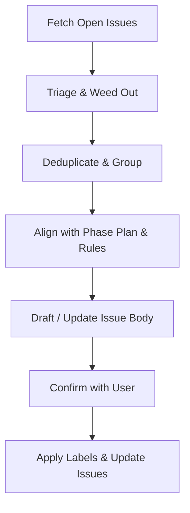

# Triage Skill

Guides the AI assistant in triaging open issues against the facility-maintenance
app phase plan (§11 of `facility-maintenance-app-plan.md`), aligning requests
with architecture and design rules, and producing well-structured internal issues
so the backlog stays clean and phase-ordered.

---

## Workflow Overview



---

## Step 1: Fetch Issues

Use the GitHub MCP tool to list open issues on `evanda/cmc`:

```
mcp__github__list_issues(owner="evanda", repo="cmc", state="OPEN")
```

Also fetch the phase plan for reference:

```
Read facility-maintenance-app-plan.md   # §11 is the phase order
```

---

## Step 2: Triage & Weeding Out

Evaluate each issue against these constraints. Flag (don't silently drop) items
that violate them — explain the violation so the user can make the call:

1. **Phase alignment (plan §11).** Every actionable issue belongs to one of the
   defined phases (0–4). Out-of-phase work that would block a lower-phase
   deliverable is a scope risk — flag it.

2. **Single-tenant, church-agnostic design (plan §7.6).** Anything that
   hardcodes a church name, address, or other instance-specific value in code
   (rather than in `org_settings` or seed data) violates the design contract.
   Reject or rework such requests.

3. **Schema contract (plan §6).** Issues that propose schema changes
   inconsistent with the data model (e.g. adding `org_id` to every table, which
   would push the project toward multi-tenancy) need explicit discussion before
   acceptance.

4. **Out-of-scope domains (plan §13).** Room booking / event scheduling, full
   accounting / GL / payroll, IoT sensor ingestion — flag these as explicitly
   out of scope for v1.

---

## Step 3: Check for Duplicate Coverage

Before grouping or drafting, cross-check each issue against the others and
against the phase plan deliverables. If two issues address the same problem,
note which should be the canonical one and which should be closed as a
duplicate.

---

## Step 4: Confirm Judgment Calls with User

**Before making any changes**, present a triage summary:

1. **Clear bugs / clear phase work** — state these as "will label + update."
2. **Deferred items** — briefly explain why each was deferred.
3. **Issues requiring judgment** — use `AskUserQuestion` for borderline items.
   Group related questions to keep it concise.

Only proceed to Step 5 after the user confirms.

---

## Step 5: Deduplication & Design Coherence

Merge related issues into a single cohesive proposal rather than tracking
fragmented one-offs.

Examples:
- Combine "add buildings CRUD" + "add floors CRUD" + "add locations CRUD" →
  **Phase 0: Buildings / Floors / Locations CRUD**
- Group "show asset on map" + "click POI to open asset" →
  **Phase 2: Map ↔ Asset linkage**

---

## Step 6: Codebase Alignment & Technical Guidance

Before drafting or updating an issue, check it against current architecture:

- **Monorepo layout:** changes touching shared types/logic go in
  `packages/shared`; web-only UI in `apps/web`; mobile in `apps/mobile`;
  map-authoring in `apps/loader`.
- **Backend:** schema changes require a Supabase migration file in
  `supabase/migrations/`; RLS policies must be updated alongside.
- **No church-specific constants in code.** Church name, logo, address, locale
  → `org_settings` table. Campus data (buildings, floors, assets) → per-instance
  seed content, never hardcoded.

---

## Step 7: Draft or Update the Issue Body

Use the template below. When updating an existing issue that already has a body,
preserve any content that's still accurate and add/replace only what needs
changing.

### Issue Template

````markdown
# feat/fix: [Descriptive Title]

**Phase:** [0 / 1 / 2 / 3 / 4 — per plan §11]

## 1. Product & Design Spec
Describe the user-facing goal. Tied to the CMMS domain vocabulary from the plan
(work order, asset, PM schedule, etc.).

## 2. Proposed Technical Architecture
Specify exactly which files/packages to touch and what new files to create.

- **Schema / Migration:**
  List any new tables, columns, or RLS changes needed in `supabase/migrations/`.
- **Shared package (`packages/shared`):**
  Types, validation schemas, or business-logic utilities (e.g. PM next-due
  calculator) that belong here.
- **Web (`apps/web`):**
  Components, routes, TanStack Query hooks.
- **Mobile (`apps/mobile`) / Loader (`apps/loader`):**
  Only if this phase touches those apps.

## 3. Implementation Checklist
- [ ] Migration file in `supabase/migrations/`
- [ ] Types in `packages/shared/src/types/`
- [ ] RLS policies updated
- [ ] API / query hooks in `apps/web/`
- [ ] UI component(s)
- [ ] Unit tests

## 4. Release Notes Draft
<!-- Pre-written so release notes can be assembled without re-reading the issue -->
**User-facing summary** (for changelog):
> [One sentence describing what this adds or fixes for the operator/user]
````

---

## Step 8: Apply Labels & Update Issues

### Available labels
Create these if they don't exist yet:

| Label | Color | Meaning |
|-------|-------|---------|
| `phase-0` | `#0075ca` | Foundation |
| `phase-1` | `#0075ca` | MVP |
| `phase-2` | `#0075ca` | Spatial |
| `phase-3` | `#0075ca` | Proactive |
| `phase-4` | `#0075ca` | Insight & mobile |
| `bug` | `#d73a4a` | Something is broken |
| `feature` | `#a2eeef` | New capability |
| `housekeeping` | `#e4e669` | Chores, deps, cleanup |
| `architecture` | `#f9d0c4` | Structural / cross-cutting |
| `future` | `#cfd3d7` | Deferred — not in current phases |

### For each confirmed issue

Update the issue body with the structured template (if it lacks one), and apply
the correct phase label. Use the GitHub MCP tools:

```
mcp__github__issue_write(owner="evanda", repo="cmc", issue_number=N,
  body="<updated body>", labels=["phase-0", "feature"])
```

Create missing labels first if needed:
```
gh label create phase-0 --repo evanda/cmc --color 0075ca --description "Phase 0: Foundation"
```

---

## Step 9: Report

After applying all updates, post a brief summary:
- Issues updated / labelled
- Issues flagged for deferral (and why)
- Any judgment calls still open

---

## Execution Guide for Agents

**Trigger:** the user saying "triage" (alone or with context like "triage the
backlog") should invoke this skill automatically.

When running:
1. Fetch open issues via GitHub MCP.
2. Read `facility-maintenance-app-plan.md` §11 for phase context.
3. Triage: identify clear work items, duplicates, scope violations, and
   judgment-call features.
4. Present the triage summary; use `AskUserQuestion` for any borderline items.
5. For confirmed items: draft/update the issue body with the template above.
6. Apply phase + type labels.
7. Report the changes made.
